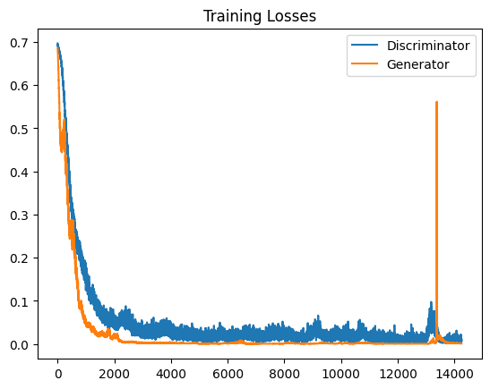
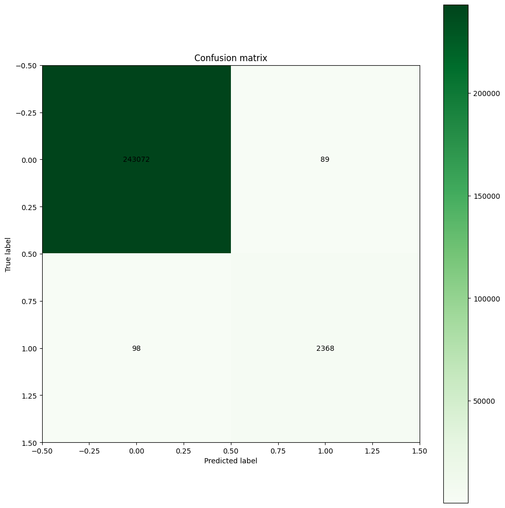
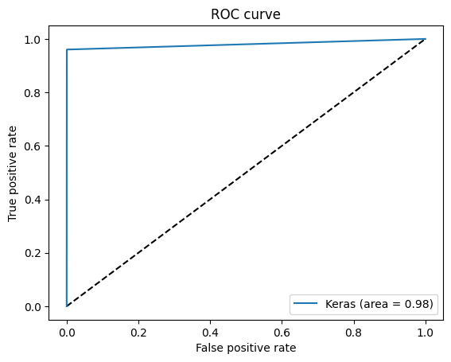

# GAN-based Network Anomaly Detection System

---

## Table of Contents
- [Project Motivation](#project-motivation)
- [Project Overview](#project-overview)
- [Project Architecture Diagram](#project-architecture-diagram)
- [Training Results and Insights](#training-results-and-insights)
  - [GAN Training Loss Curves](#gan-training-loss-curves)
  - [Confusion Matrix Interpretation](#confusion-matrix-interpretation)
  - [ROC Curve Interpretation](#roc-curve-interpretation)
- [Capabilities](#capabilities)
- [How to Run This Project](#how-to-run-this-project)
- [Libraries and Tools Used](#libraries-and-tools-used)

---

## Project Motivation

In modern network environments, detecting malicious activities and abnormal traffic is critical for maintaining security and system integrity. Traditional methods for anomaly detection often rely on large labeled datasets and handcrafted features, which can be time-consuming and less adaptable to evolving threats.

This project was built to explore an **unsupervised deep learning approach** — specifically using **Generative Adversarial Networks (GANs)** — to effectively detect anomalies in network traffic with minimal reliance on labeled anomalies. The goal is to create a model capable of learning the distribution of normal behavior and identifying deviations without needing exhaustive labeling.

---

## Project Overview

The project uses a GAN architecture consisting of two neural networks:

- A **Generator** network that learns to produce synthetic network traffic data.
- A **Discriminator** network that learns to distinguish between real (normal) network traffic and synthetic (generated) data.

### Key Steps:
- **Data Preprocessing:** Normalized and preprocessed the dataset, initially training only on normal traffic.
- **GAN Training:** The generator and discriminator were trained adversarially until meaningful representations of normal behavior were learned.
- **Testing Phase:** The discriminator's scores were used to detect anomalies in unseen data.
- **Performance Evaluation:** Used Accuracy, Precision, Recall, F1-Score, and ROC-AUC for evaluation.

---

## Project Architecture Diagram

Below is a detailed architecture diagram for the GAN-based anomaly detection system:

```
                         +----------------------+
                         |  Preprocessed Dataset |
                         +----------+-----------+
                                    |
                                    v
                      +-------------+-------------+
                      |      Generator (G)         |
                      | - Takes random noise input |
                      | - Generates synthetic data |
                      +-------------+-------------+
                                    |
                                    v
          +-------------------+            +------------------------+
          | Real Normal Data   |            |  Fake Generated Data    |
          +---------+----------+            +-----------+------------+
                    |                               |
                    v                               v
                  +-------------------------------------+
                  |         Discriminator (D)           |
                  | - Distinguishes Real vs. Generated  |
                  | - Outputs probability scores        |
                  +-------------------------------------+
                                    |
                                    v
                          +--------------------+
                          |   Anomaly Detector  |
                          | - High score → Normal|
                          | - Low score → Anomaly|
                          +--------------------+
                                    |
                                    v
                          +--------------------+
                          |    Evaluation       |
                          | - Confusion Matrix  |
                          | - ROC Curve         |
                          | - Accuracy, Recall  |
                          +--------------------+
```

---

## Training Results and Insights

### GAN Training Loss Curves



The above graph visualizes the training behavior:
- **Blue curve**: Discriminator loss
- **Orange curve**: Generator loss

Initially, both losses were high, but rapidly decreased in the first few thousand steps, showing effective early learning. Afterward, losses stabilized with minor fluctuations, a sign of healthy competition between the two networks.

A notable spike in Generator loss occurred late during training but self-corrected quickly, indicating robustness.

**Summary:**
- Stable adversarial training
- Balanced Generator and Discriminator performance
- Minor instabilities were normal and well-managed

---

### Confusion Matrix Interpretation



|                        | **Predicted Normal (0)** | **Predicted Anomaly (1)** |
|------------------------|---------------------------|----------------------------|
| **True Normal (0)**     | 243,072                   | 89                         |
| **True Anomaly (1)**    | 98                        | 2,368                      |

**How to Read It:**
- **True Negative (243,072)**: Normal packets correctly classified
- **False Positive (89)**: Normal packets misclassified as anomalies
- **False Negative (98)**: Anomalies misclassified as normal
- **True Positive (2,368)**: Anomalies correctly detected

**Interpretation:**
- Very high **True Negative** and **True Positive** counts
- Very low **False Positives** and **False Negatives**
- Strong anomaly detection capabilities with minimal false alarms

**Mean Scores:**
```
Mean score for normal packets: 0.99867
Mean score for anomalous packets: 0.08145
```

---

### ROC Curve Interpretation



The ROC curve shows:
- Rapid rise toward the top-left, indicating high TPR and low FPR
- Model performance is far above random (diagonal line)

**AUC Score:**
- Achieved **0.98 AUC**, suggesting 98% probability of correctly distinguishing normal from anomalous traffic.

**Conclusion:**
- Excellent discrimination capability
- Highly suitable for real-world deployment in network security systems

---

## Capabilities

- Detect anomalies in network traffic with **high precision** and **low false alarm rates**.
- Generalize to **unseen threats** by learning normal behavior patterns.
- Provide **interpretable outputs**, such as anomaly scores.
- **Visualize performance** through ROC curves and confusion matrices.

With a high ROC-AUC score of **0.98**, the system shows strong potential for cybersecurity, intrusion detection, and network health monitoring applications.

---

## How to Run This Project

### Prerequisites
- Python 3.10
- Required Python packages (install using `pip install -r requirements.txt`)

### Dataset
The project requires two dataset files which are too large to be included in the repository. Please download them from the following links:

1. Original dataset: [kddcup.data.corrected](https://mega.nz/file/0dh1zKYR#BjeqLrZJm5x4xqugwOk6gjsAbMZA6fCKXZVn9v_818E)
2. Preprocessed dataset: [preprocessed_data_full.pkl](https://mega.nz/file/RFQ33S7Q#spPvV3KxYqdl_ir6YCh1Mr04U7Gbzl-zmDnOJP46TMA)

Place these files in the project root directory before running the code.

### Running the Project

### 1. Clone the Repository
```bash
git clone <your-repo-url>
cd <your-repo-directory>
```

### 2. Set Up the Python Environment
It is recommended to use a virtual environment:
```bash
python -m venv tf_env
# On Windows:
tf_env\Scripts\activate
# On Linux/Mac:
source tf_env/bin/activate
```

### 3. Install Dependencies
```bash
pip install -r requirements.txt
```

### 4. Download the Dataset
- Place the `kddcup.data.corrected` file in the project root directory (already present in this repo if you see it).

### 5. Preprocess the Data
Run the preprocessing script to generate the preprocessed data file:
```bash
python preprocess.py --pct_anomalies 0.01
```
- This will create `preprocessed_data_full.pkl` in the project directory.
- You can adjust the `--pct_anomalies` parameter to control the proportion of anomalies in the training data.

### 6. Run the GAN Model
Open and run the Jupyter notebook:
```bash
jupyter notebook AnomalyDetectionGans.ipynb
```
- Follow the notebook cells sequentially to train the GAN and evaluate its performance.
- The notebook will generate and display the loss curves, confusion matrix, and ROC curve.

### 7. View Results
- The output images (`output.png`, `confusion_matrix.png`, `roc_curve.png`) will be generated and saved in the project directory.
- These images are referenced in this README for your convenience.

---

## Libraries and Tools Used

- Python 3.10+
- TensorFlow / Keras
- Scikit-learn
- Pandas / Numpy
- Matplotlib
- tqdm

---

> **Note:** If you add or move images, update the image paths in this README accordingly.
> For best results, use a GPU-enabled environment for training the GAN, especially on large datasets.

---

## Contact
For questions, suggestions, or contributions, please open an issue or submit a pull request. 

---

## License

This project is licensed under the [MIT License](LICENSE). You are free to use, modify, and distribute this software with proper attribution. 